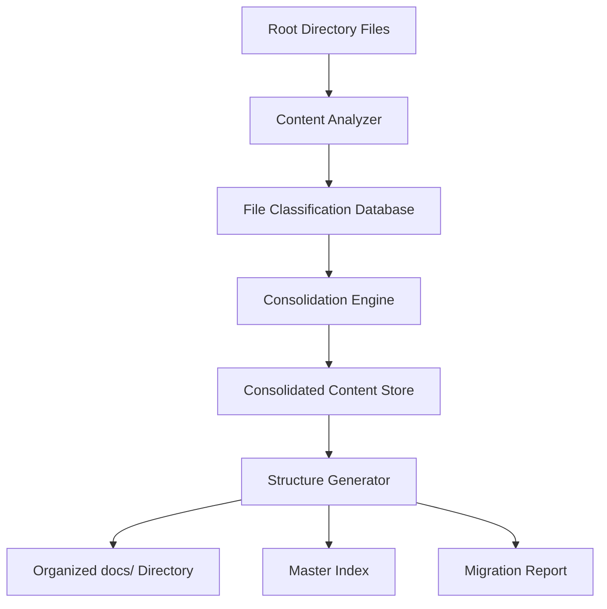

# Design Document: Documentation Consolidation System

## Overview

The Documentation Consolidation System will transform the current scattered collection of 100+ markdown files in the project root into a well-organized, hierarchical documentation structure following Django project conventions. The system will analyze, categorize, consolidate, and reorganize existing documentation while preserving all important information and creating a navigable structure that enhances developer productivity.

The solution consists of three main components: a Content Analyzer that examines existing files to determine categorization, a Consolidation Engine that merges related content and eliminates redundancy, and a Structure Generator that creates the final organized documentation hierarchy with proper navigation.

## Architecture

The system follows a pipeline architecture with three sequential phases:



### Phase 1: Analysis and Classification
- Scan all markdown files in the root directory
- Analyze file names, content, and metadata
- Classify files into categories and identify consolidation opportunities
- Generate classification database for processing

### Phase 2: Content Consolidation
- Process related files for merging opportunities
- Eliminate redundant information while preserving unique content
- Create consolidated documents with proper cross-references
- Maintain content integrity and historical context

### Phase 3: Structure Generation
- Create hierarchical folder structure in docs/
- Generate master index and navigation documents
- Move and organize all processed files
- Create migration report and validation checklist

## Components and Interfaces

### Content Analyzer Component

**Purpose**: Examines existing markdown files to determine categorization and consolidation opportunities.

**Key Methods**:
- `analyze_file(filepath: str) -> FileAnalysis`: Analyzes individual file content and metadata
- `classify_by_pattern(filename: str) -> Category`: Determines category based on naming patterns
- `extract_content_metadata(content: str) -> ContentMetadata`: Extracts timestamps, authors, and key topics
- `identify_consolidation_candidates() -> List[ConsolidationGroup]`: Groups related files for merging

**File Classification Categories**:
- **Setup & Configuration**: Files ending with `_SETUP.md`, containing installation/configuration content
- **Feature Documentation**: Files with feature prefixes (`PAYMENT_*`, `TOURNAMENT_*`, etc.)
- **Implementation Completion**: Files matching `TASK_*_COMPLETE.md` or `*_COMPLETE.md` patterns
- **Testing & Validation**: Files containing test reports, validation results, or testing guides
- **Quick References**: Files with `QUICK_*` patterns or reference content
- **Integration Guides**: Files containing integration, API, or system connection documentation
- **Historical/Archive**: Outdated files that should be preserved but archived

### Consolidation Engine Component

**Purpose**: Processes related files to create unified, comprehensive documentation.

**Key Methods**:
- `consolidate_group(group: ConsolidationGroup) -> ConsolidatedDocument`: Merges related files
- `preserve_chronology(files: List[File]) -> ChronologicalContent`: Maintains implementation timeline
- `eliminate_redundancy(content: List[Content]) -> UniqueContent`: Removes duplicate information
- `create_cross_references(documents: List[Document]) -> ReferenceMap`: Links related content

**Consolidation Strategies**:
- **Completion Summaries**: Merge multiple `*_COMPLETE.md` files into comprehensive implementation histories
- **Feature Guides**: Combine fragmented feature documentation into complete user guides
- **Setup Procedures**: Consolidate setup files into step-by-step installation guides
- **Testing Documentation**: Unify testing guides, reports, and procedures

### Structure Generator Component

**Purpose**: Creates the final organized documentation hierarchy with proper navigation.

**Key Methods**:
- `create_directory_structure() -> DirectoryTree`: Builds the docs/ folder hierarchy
- `generate_master_index() -> IndexDocument`: Creates comprehensive navigation document
- `organize_files(classified_files: List[ClassifiedFile]) -> OrganizedStructure`: Places files in appropriate locations
- `create_migration_report() -> MigrationReport`: Documents all changes made during consolidation

## Data Models

### FileAnalysis Model
```python
class FileAnalysis:
    filepath: str
    filename: str
    category: Category
    content_type: ContentType
    creation_date: Optional[datetime]
    last_modified: datetime
    word_count: int
    key_topics: List[str]
    consolidation_candidates: List[str]
    preservation_priority: Priority
```

### ConsolidationGroup Model
```python
class ConsolidationGroup:
    group_id: str
    category: Category
    primary_file: str
    related_files: List[str]
    consolidation_strategy: ConsolidationStrategy
    output_filename: str
    cross_references: List[str]
```

### DocumentationStructure Model
```python
class DocumentationStructure:
    root_path: str = "docs/"
    categories: Dict[Category, DirectoryConfig]
    master_index: IndexConfig
    archive_section: ArchiveConfig
    migration_log: MigrationLog
```

### Directory Structure Design

Based on Django documentation conventions and content analysis, the following structure will be created:

```
docs/
├── README.md                          # Master index and navigation
├── setup/                            # Installation and configuration
│   ├── installation.md              # Consolidated setup guides
│   ├── configuration.md             # Configuration procedures
│   └── troubleshooting.md           # Setup troubleshooting
├── features/                         # Feature-specific documentation
│   ├── authentication/              # Auth system docs
│   ├── payments/                    # Payment system docs
│   ├── tournaments/                 # Tournament management docs
│   ├── notifications/               # Notification system docs
│   └── dashboard/                   # Dashboard functionality docs
├── development/                      # Developer guides
│   ├── quick-start.md               # Developer onboarding
│   ├── testing-guide.md             # Testing procedures
│   ├── integration-guide.md         # Integration documentation
│   └── api-reference.md             # API documentation
├── implementation/                   # Implementation history
│   ├── completion-summary.md        # Consolidated completion reports
│   ├── phase-summaries/             # Phase-by-phase implementation
│   └── task-histories/              # Detailed task completion records
├── testing/                         # Testing documentation
│   ├── test-reports/                # Test execution reports
│   ├── validation-results/          # Validation and compliance results
│   └── testing-procedures.md       # Testing methodologies
├── reference/                       # Quick references and guides
│   ├── quick-references.md          # Consolidated quick guides
│   ├── troubleshooting.md           # Common issues and solutions
│   └── glossary.md                  # Terms and definitions
└── archive/                         # Historical documentation
    ├── deprecated/                  # Outdated but preserved content
    └── migration-log.md             # Record of consolidation process
```

## Correctness Properties

*A property is a characteristic or behavior that should hold true across all valid executions of a system—essentially, a formal statement about what the system should do. Properties serve as the bridge between human-readable specifications and machine-verifiable correctness guarantees.*

### Property 1: Directory Structure Creation
*For any* execution of the Documentation_System, the docs/ directory should contain all required subdirectories (setup/, features/, development/, implementation/, testing/, reference/, archive/) with proper hierarchical organization.
**Validates: Requirements 1.1, 1.3, 4.1**

### Property 2: File Categorization Accuracy
*For any* markdown file in the root directory, the Content_Analyzer should correctly categorize it based on naming patterns and content analysis, handling edge cases where files could belong to multiple categories.
**Validates: Requirements 2.1, 2.2, 2.3, 2.4, 2.5, 2.6**

### Property 3: Content Preservation During Processing
*For any* file processed by the system, all important information, technical specifications, author attribution, and timestamps should be preserved in the final organized documentation without loss or corruption.
**Validates: Requirements 1.5, 5.1, 5.3, 5.4, 8.3**

### Property 4: Consolidation Integrity
*For any* group of related files, the Consolidation_Engine should merge them into unified guides while eliminating duplicate information, preserving chronological order, and maintaining all unique insights with appropriate cross-references.
**Validates: Requirements 3.1, 3.2, 3.3, 3.4, 3.5**

### Property 5: Index Organization and Navigation
*For any* generated master index, it should organize links by category with clear descriptions, maintain consistent naming conventions, and include appropriate links to both consolidated and individual documents.
**Validates: Requirements 4.2, 4.4, 4.5**

### Property 6: Backup and Migration Logging
*For any* file operation performed by the system, backup copies should be created before modification and all movements, consolidations, and changes should be documented in a comprehensive migration log.
**Validates: Requirements 5.2, 8.4**

### Property 7: Outdated Content Management
*For any* file analyzed by the system, potentially outdated content should be identified based on timestamps and references, with appropriate freshness indicators and archival recommendations provided.
**Validates: Requirements 7.1, 7.2, 7.4, 7.5**

### Property 8: Django Convention Compliance
*For any* generated documentation structure, it should follow Django project documentation conventions including consistent markdown formatting, appropriate navigation patterns, and standard section organization.
**Validates: Requirements 6.1, 6.2, 6.3**

### Property 9: Validation and Quality Assurance
*For any* consolidated documentation, all markdown files should be properly formatted and all internal links should be functional after reorganization.
**Validates: Requirements 8.1, 8.2**

### Property 10: Manual Review Flagging
*For any* content that cannot be automatically categorized, the system should flag it for manual review rather than making incorrect assumptions about placement.
**Validates: Requirements 5.5**

## Error Handling

The system implements comprehensive error handling across all components:

### File System Errors
- **Missing Files**: If referenced files are not found, log the issue and continue processing remaining files
- **Permission Errors**: If files cannot be read or written, create detailed error reports and skip problematic files
- **Disk Space**: Monitor available disk space and halt processing if insufficient space for backups and new structure

### Content Processing Errors
- **Malformed Markdown**: Flag files with syntax errors for manual review while preserving original content
- **Encoding Issues**: Attempt multiple encoding strategies and flag files that cannot be properly decoded
- **Large Files**: Implement streaming processing for files exceeding memory limits

### Categorization Errors
- **Ambiguous Classification**: When files could belong to multiple categories, use confidence scoring and flag low-confidence assignments
- **Unknown Patterns**: Create a special "uncategorized" section for files that don't match any known patterns
- **Circular References**: Detect and break circular reference chains in cross-referencing

### Consolidation Errors
- **Conflicting Information**: When merging files with contradictory information, preserve both versions with clear annotations
- **Missing Dependencies**: If consolidated files reference missing content, create placeholder sections with clear indicators
- **Version Conflicts**: When multiple versions of the same information exist, maintain chronological order and highlight differences

## Testing Strategy

The Documentation Consolidation System requires a dual testing approach combining unit tests for specific functionality and property-based tests for comprehensive validation across diverse input scenarios.

### Unit Testing Approach
Unit tests will focus on specific examples, edge cases, and error conditions:

- **File Pattern Recognition**: Test specific filename patterns against expected categorizations
- **Content Parsing**: Verify correct extraction of metadata from sample markdown files
- **Directory Creation**: Test creation of specific directory structures
- **Error Handling**: Test specific error scenarios like missing files or permission issues
- **Integration Points**: Test interactions between Content Analyzer, Consolidation Engine, and Structure Generator

### Property-Based Testing Configuration
Property-based tests will validate universal properties across randomized inputs using **Hypothesis** (Python property-based testing library). Each test will run a minimum of 100 iterations to ensure comprehensive coverage.

**Property Test Implementation Requirements**:
- Each correctness property must be implemented as a single property-based test
- Tests must generate diverse markdown files with varying content, naming patterns, and structures
- File generators should create realistic documentation scenarios including edge cases
- Each test must be tagged with: **Feature: documentation-consolidation, Property {number}: {property_text}**

**Test Data Generation Strategy**:
- **File Name Generators**: Create realistic filename patterns including completion files, feature files, setup guides, and edge cases
- **Content Generators**: Generate markdown content with varying structures, metadata, and cross-references
- **Directory Structure Generators**: Create diverse initial directory states for testing
- **Error Condition Generators**: Simulate various file system and content errors

**Validation Approach**:
- **Before/After Comparison**: Compare file system state and content integrity before and after processing
- **Structure Validation**: Verify generated directory structures match expected patterns
- **Content Preservation**: Ensure all important information is preserved through processing
- **Link Integrity**: Validate that all internal links remain functional after reorganization

The combination of unit tests and property-based tests ensures both specific functionality correctness and general system reliability across the wide variety of documentation scenarios that exist in real Django projects.