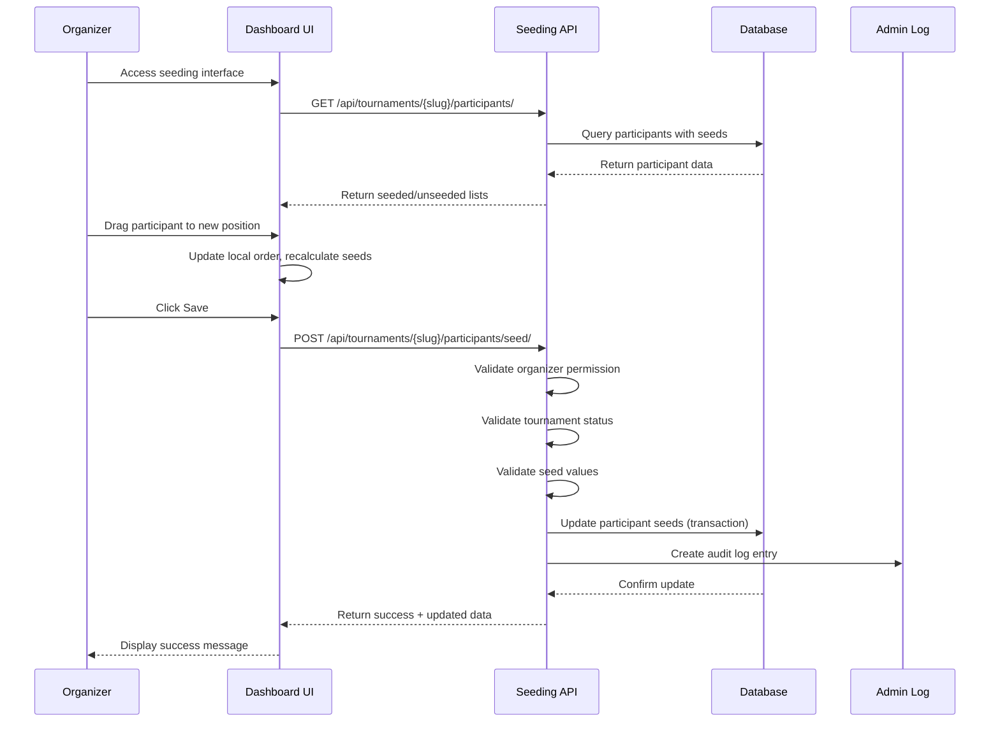

# Design Document: Manual Seeding Management

## Overview

This design document specifies the technical implementation for manual seeding management capabilities in the tournament system. The feature enables tournament organizers to assign and modify participant seed positions through both Django Admin and the organizer frontend dashboard when manual seeding is selected.

### Goals

- Provide intuitive seeding management interfaces in both Django Admin and organizer dashboard
- Enable drag-and-drop reordering and direct seed input for flexible seeding workflows
- Ensure data integrity through validation, conflict detection, and audit logging
- Lock seeding modifications after tournament start to maintain bracket integrity
- Support bulk operations for efficient management of large tournaments

### Non-Goals

- Automatic skill-based seeding algorithms (already exists as separate seeding method)
- Bracket regeneration after seeding changes (requires separate bracket management feature)
- Real-time collaborative seeding (multiple organizers editing simultaneously)
- Historical seeding analytics or recommendations

## Architecture

### System Components

The manual seeding management feature integrates with existing tournament infrastructure through three primary layers:

1. **Backend Layer (Django)**
   - API endpoint for seeding operations (`/api/tournaments/{slug}/participants/seed/`)
   - Admin interface enhancements for seed display and editing
   - Validation logic for seed assignments and conflict detection
   - Audit logging through Django's admin log system

2. **Frontend Layer (JavaScript)**
   - Seeding management interface component for organizer dashboard
   - Drag-and-drop interaction handler using native HTML5 Drag and Drop API
   - Real-time validation and conflict highlighting
   - Integration with existing polling/update mechanisms

3. **Data Layer**
   - Existing `Participant.seed` field (already present in model)
   - Django admin log entries for audit trail
   - No new database tables required

### Component Interaction Flow



### Data Flow

1. **Read Flow**: Dashboard fetches participants via existing participants API, filters by status='confirmed', orders by seed (nulls last)
2. **Write Flow**: Dashboard sends seed assignments to new seeding API endpoint, which validates and updates in single transaction
3. **Validation Flow**: Backend validates organizer permission, tournament status, and seed values before persisting changes
4. **Audit Flow**: All seed modifications logged via Django admin log system with old/new values

## Components and Interfaces

### Backend Components

#### 1. Seeding API Endpoint

**Endpoint**: `POST /api/tournaments/{slug}/participants/seed/`

**Request Body**:
```json
{
  "seeds": [
    {
      "participant_id": "uuid-string",
      "seed": 1
    },
    {
      "participant_id": "uuid-string",
      "seed": 2
    }
  ]
}
```

**Response (Success - 200)**:
```json
{
  "success": true,
  "message": "Seeds updated successfully",
  "participants": [
    {
      "id": "uuid-string",
      "display_name": "Player Name",
      "seed": 1,
      "status": "confirmed"
    }
  ]
}
```

**Response (Error - 400)**:
```json
{
  "success": false,
  "error": "Invalid seed values",
  "details": {
    "invalid_seeds": [0, -1],
    "duplicate_seeds": [3, 3]
  }
}
```

**Response (Error - 403)**:
```json
{
  "success": false,
  "error": "Permission denied. Only tournament organizers can modify seeds."
}
```

**Response (Error - 409)**:
```json
{
  "success": false,
  "error": "Tournament has already started. Seeding is locked."
}
```

**Validation Rules**:
- User must be tournament organizer or superuser
- Tournament status must be in ['draft', 'registration', 'check_in']
- Tournament seeding_method must be 'manual'
- All seed values must be positive integers or null
- All participant_ids must belong to the tournament
- All participants must have status='confirmed'

#### 2. Auto-Seed Endpoint

**Endpoint**: `POST /api/tournaments/{slug}/participants/auto-seed/`

**Request Body**:
```json
{
  "method": "registration_order"
}
```

**Response (Success - 200)**:
```json
{
  "success": true,
  "message": "Auto-seeding completed. 16 participants seeded.",
  "participants": [...]
}
```

**Logic**: Assigns seeds sequentially (1, 2, 3...) based on `registered_at` timestamp (earliest = seed 1)

#### 3. Django Admin Enhancements

**ParticipantInline Changes**:
```python
class ParticipantInline(admin.TabularInline):
    model = Participant
    extra = 0
    fields = ['user', 'team', 'status', 'checked_in', 'seed', 'final_placement']
    readonly_fields = ['registered_at']
    raw_id_fields = ['user', 'team']
    
    def get_readonly_fields(self, request, obj=None):
        # Make seed readonly if tournament has started
        if obj and obj.status in ['in_progress', 'completed']:
            return self.readonly_fields + ['seed']
        return self.readonly_fields
```

**ParticipantAdmin Changes**:
```python
@admin.register(Participant)
class ParticipantAdmin(admin.ModelAdmin):
    list_display = ['display_name', 'tournament', 'status', 'seed', 
                    'checked_in', 'match_record', 'final_placement']
    list_filter = ['status', 'checked_in', 'tournament__game', 'registered_at']
    search_fields = ['user__username', 'user__email', 'team__name', 
                     'tournament__name']
    ordering = ['tournament', 'seed', 'registered_at']  # Add seed to ordering
    
    actions = ['check_in_participants', 'confirm_participants', 
               'disqualify_participants', 'assign_sequential_seeds']
    
    def assign_sequential_seeds(self, request, queryset):
        """Bulk action to assign sequential seeds"""
        # Implementation in admin.py
```

### Frontend Components

#### 1. Seeding Management Interface

**Location**: New template `templates/tournaments/components/seeding_interface.html`

**Component Structure**:
```html
<div id="seeding-interface" class="seeding-container">
  <!-- Header with stats -->
  <div class="seeding-header">
    <h3>Manage Seeding</h3>
    <div class="seeding-stats">
      <span>Seeded: <strong id="seeded-count">0</strong></span>
      <span>Unseeded: <strong id="unseeded-count">0</strong></span>
    </div>
    <div class="seeding-actions">
      <button id="auto-seed-btn" class="btn-secondary">Auto-Seed</button>
      <button id="save-seeds-btn" class="btn-primary">Save Changes</button>
    </div>
  </div>
  
  <!-- Seeded participants list -->
  <div class="seeded-section">
    <h4>Seeded Participants</h4>
    <div id="seeded-list" class="participant-list sortable">
      <!-- Participant rows rendered here -->
    </div>
  </div>
  
  <!-- Unseeded participants list -->
  <div class="unseeded-section">
    <h4>Unseeded Participants</h4>
    <div id="unseeded-list" class="participant-list">
      <!-- Unseeded participant rows rendered here -->
    </div>
  </div>
  
  <!-- Conflict warnings -->
  <div id="seed-conflicts" class="alert alert-warning" style="display: none;">
    <strong>Warning:</strong> Duplicate seeds detected: <span id="conflict-details"></span>
  </div>
</div>
```

**Participant Row Template**:
```html
<div class="participant-row" data-participant-id="{id}" draggable="true">
  <span class="drag-handle">⋮⋮</span>
  <input type="number" class="seed-input" value="{seed}" min="1" />
  <span class="participant-name">{display_name}</span>
  <span class="participant-status">{status}</span>
</div>
```

#### 2. JavaScript Module: SeedingManager

**Location**: `static/js/modules/seeding-manager.js`

**Class Structure**:
```javascript
class SeedingManager {
  constructor(tournamentSlug) {
    this.tournamentSlug = tournamentSlug;
    this.participants = [];
    this.hasChanges = false;
    this.init();
  }
  
  async init() {
    await this.loadParticipants();
    this.setupDragAndDrop();
    this.setupEventListeners();
    this.render();
  }
  
  async loadParticipants() {
    // Fetch from /api/tournaments/{slug}/participants/
  }
  
  setupDragAndDrop() {
    // Initialize HTML5 drag and drop on seeded list
  }
  
  setupEventListeners() {
    // Save button, auto-seed button, seed input changes
  }
  
  handleDragStart(event) { }
  handleDragOver(event) { }
  handleDrop(event) { }
  
  recalculateSeeds() {
    // Update seed values based on current order
  }
  
  detectConflicts() {
    // Find duplicate seed values
  }
  
  async saveSeeds() {
    // POST to /api/tournaments/{slug}/participants/seed/
  }
  
  async autoSeed() {
    // POST to /api/tournaments/{slug}/participants/auto-seed/
  }
  
  render() {
    // Render seeded and unseeded lists
  }
}
```

**Integration Point**: Add to tournament detail page or organizer dashboard when `tournament.seeding_method === 'manual'` and user is organizer

## Data Models

### Existing Models (No Changes Required)

The feature uses existing database schema without modifications:

**Participant Model** (already exists):
```python
class Participant(models.Model):
    id = models.UUIDField(primary_key=True, default=uuid.uuid4)
    tournament = models.ForeignKey(Tournament, on_delete=models.CASCADE)
    user = models.ForeignKey(User, on_delete=models.CASCADE, null=True, blank=True)
    team = models.ForeignKey(Team, on_delete=models.CASCADE, null=True, blank=True)
    status = models.CharField(max_length=20, choices=STATUS_CHOICES)
    seed = models.IntegerField(null=True, blank=True)  # ← Used for seeding
    registered_at = models.DateTimeField(auto_now_add=True)
    # ... other fields
```

**Tournament Model** (already exists):
```python
class Tournament(models.Model):
    seeding_method = models.CharField(max_length=20, choices=[
        ('random', 'Random'),
        ('skill', 'Skill-based'),
        ('manual', 'Manual'),  # ← Enables manual seeding interface
        ('registration', 'Registration Order'),
    ])
    status = models.CharField(max_length=20, choices=STATUS_CHOICES)
    # ... other fields
```

### Database Indexes

Existing indexes are sufficient:
- `Participant.Meta.ordering = ['seed', 'registered_at']` provides efficient seed-based queries
- `Tournament` indexes on status and organizer support permission checks

### Audit Logging

Uses Django's built-in `LogEntry` model (no custom tables needed):
```python
from django.contrib.admin.models import LogEntry, CHANGE

LogEntry.objects.create(
    user_id=request.user.id,
    content_type_id=ContentType.objects.get_for_model(Participant).pk,
    object_id=participant.id,
    object_repr=str(participant),
    action_flag=CHANGE,
    change_message=f"Seed changed from {old_seed} to {new_seed}"
)
```


## Correctness Properties

*A property is a characteristic or behavior that should hold true across all valid executions of a system—essentially, a formal statement about what the system should do. Properties serve as the bridge between human-readable specifications and machine-verifiable correctness guarantees.*

### Property 1: Seed Value Validation

*For any* seed value input (whether through admin, API, or dashboard), the system SHALL accept only positive integers (1, 2, 3, ...) or null, and SHALL reject zero, negative integers, and non-integer values.

**Validates: Requirements 2.3, 6.2**

### Property 2: Sequential Bulk Seeding

*For any* set of participants selected for bulk seed assignment, the system SHALL assign seeds starting from 1 and incrementing by 1 for each participant in the order they were selected (1, 2, 3, ..., n).

**Validates: Requirements 3.2**

### Property 3: Bulk Action Isolation

*For any* tournament with participants, when bulk seed assignment is applied to a subset of participants, all participants not included in the bulk action SHALL retain their original seed values unchanged.

**Validates: Requirements 3.4**

### Property 4: Confirmed Participant Filtering

*For any* tournament, the seeding interface SHALL display exactly those participants whose status is 'confirmed', excluding all participants with other statuses (pending, rejected, withdrawn, disqualified).

**Validates: Requirements 4.3**

### Property 5: Seed-Based Ordering with Nulls Last

*For any* set of participants with mixed seed values (including nulls), the seeding interface SHALL display them ordered by seed value in ascending order (1, 2, 3, ...) with all null-seeded participants appearing after all seeded participants.

**Validates: Requirements 4.4**

### Property 6: Drag-and-Drop Seed Recalculation

*For any* reordering of participants via drag-and-drop, the system SHALL automatically recalculate and assign seed values as 1, 2, 3, ... based on the new display order from top to bottom.

**Validates: Requirements 5.3**

### Property 7: Seed Persistence

*For any* valid seed value entered and saved through the dashboard, the system SHALL persist that exact seed value to the database and return it in subsequent queries for that participant.

**Validates: Requirements 6.4, 7.4**

### Property 8: Organizer Authorization

*For any* user who is not the tournament organizer or a superuser, all seed modification requests (via API or admin) SHALL be rejected with a 403 Forbidden response.

**Validates: Requirements 7.3, 12.2**

### Property 9: Tournament Status-Based Locking

*For any* tournament with status 'in_progress' or 'completed', all seed modification requests SHALL be rejected by the backend with an error indicating seeding is locked, and the dashboard SHALL display seed inputs as read-only.

**Validates: Requirements 8.1, 8.2**

### Property 10: Tournament Status-Based Editing

*For any* tournament with status 'draft', 'registration', or 'check_in', the dashboard SHALL allow seed modifications (inputs enabled) and the backend SHALL accept valid seed modification requests.

**Validates: Requirements 8.4**

### Property 11: Auto-Seed Registration Order

*For any* set of confirmed participants in a tournament, when auto-seed is executed, the system SHALL assign seed 1 to the participant with the earliest registered_at timestamp, seed 2 to the second earliest, and so on sequentially.

**Validates: Requirements 9.3, 9.5**

### Property 12: Duplicate Seed Logging

*For any* seed save operation that results in duplicate seed values within a tournament, the backend SHALL accept the save operation and create an audit log entry indicating the duplicate seeds exist.

**Validates: Requirements 10.4**

### Property 13: Unseeded Participant Segregation

*For any* tournament, participants with null seed values SHALL be displayed in a separate "Unseeded" section, and the unseeded count SHALL equal the number of participants with null seeds.

**Validates: Requirements 11.1, 11.2**

### Property 14: Seeding Method Validation

*For any* tournament with seeding_method not equal to 'manual', seed modification requests to the API SHALL be rejected with a 400 Bad Request response indicating manual seeding is not enabled.

**Validates: Requirements 12.3**

### Property 15: Transactional Seed Updates

*For any* batch of seed assignments submitted to the API, either all participant seeds SHALL be updated successfully, or none SHALL be updated (atomic transaction), ensuring the database never contains a partially applied seed update.

**Validates: Requirements 12.4**

### Property 16: Seed Change Audit Logging

*For any* seed modification operation, the system SHALL create an audit log entry containing the timestamp, user who made the change, participant identifier, tournament name, participant name, old seed value, and new seed value.

**Validates: Requirements 13.1, 13.4**

## Error Handling

### Validation Errors

**Scenario**: Invalid seed values submitted
- **Detection**: Backend validates all seed values are positive integers or null
- **Response**: HTTP 400 with JSON error details listing invalid values
- **User Feedback**: Dashboard displays error message highlighting invalid inputs
- **Recovery**: User corrects invalid values and resubmits

**Scenario**: Duplicate seed values detected
- **Detection**: Frontend scans for duplicate seeds before save; backend logs duplicates
- **Response**: Frontend shows warning with conflicting seed numbers; backend accepts but logs
- **User Feedback**: Warning banner with "Duplicate seeds: 3, 5" and confirmation prompt
- **Recovery**: User can proceed with duplicates or fix them

**Scenario**: Participant not found or doesn't belong to tournament
- **Detection**: Backend validates all participant IDs exist and belong to tournament
- **Response**: HTTP 400 with error details listing invalid participant IDs
- **User Feedback**: Dashboard displays error message
- **Recovery**: Dashboard reloads participant list to sync state

### Authorization Errors

**Scenario**: Non-organizer attempts to modify seeds
- **Detection**: Backend checks `request.user == tournament.organizer` or `request.user.is_superuser`
- **Response**: HTTP 403 with error message "Permission denied. Only tournament organizers can modify seeds."
- **User Feedback**: Dashboard displays permission error
- **Recovery**: User must be granted organizer access or use correct account

**Scenario**: Tournament seeding is locked (started)
- **Detection**: Backend checks tournament status not in ['in_progress', 'completed']
- **Response**: HTTP 409 with error message "Tournament has already started. Seeding is locked."
- **User Feedback**: Dashboard displays lock message and disables all seed inputs
- **Recovery**: No recovery - seeding cannot be modified after tournament starts

### Network Errors

**Scenario**: API request fails due to network issues
- **Detection**: Frontend catches fetch errors or timeout
- **Response**: Retry logic with exponential backoff (3 attempts)
- **User Feedback**: Loading indicator, then error message "Failed to save. Please try again."
- **Recovery**: User clicks save again; dashboard retains unsaved changes

**Scenario**: API returns unexpected response format
- **Detection**: Frontend validates response structure
- **Response**: Log error to console, treat as failed save
- **User Feedback**: Generic error message "An error occurred. Please refresh and try again."
- **Recovery**: User refreshes page to reset state

### Data Integrity Errors

**Scenario**: Concurrent modification (another user changed seeds)
- **Detection**: Backend could implement optimistic locking with version field (future enhancement)
- **Response**: HTTP 409 with error "Seeds have been modified by another user"
- **User Feedback**: Dashboard prompts to reload and review changes
- **Recovery**: User reloads, reviews current state, makes changes again

**Scenario**: Database transaction fails
- **Detection**: Django transaction rollback on any database error
- **Response**: HTTP 500 with generic error message
- **User Feedback**: Dashboard displays "Server error. Please try again."
- **Recovery**: User retries; if persistent, admin investigates database issues

### Edge Cases

**Scenario**: All participants unseeded
- **Handling**: Dashboard shows empty seeded list, all participants in unseeded section
- **User Feedback**: "0 seeded, N unseeded" counter
- **Recovery**: User can drag participants to seeded list or use auto-seed

**Scenario**: No confirmed participants
- **Handling**: Dashboard shows empty state message "No confirmed participants to seed"
- **User Feedback**: Informational message with link to participant management
- **Recovery**: User confirms participants first

**Scenario**: Tournament has no participants
- **Handling**: Dashboard shows empty state "No participants registered"
- **User Feedback**: Informational message
- **Recovery**: User waits for registrations or adds participants manually

**Scenario**: Seed value exceeds participant count (e.g., seed 100 with 16 participants)
- **Handling**: System accepts any positive integer (no upper bound validation)
- **Rationale**: Organizers may want gaps in seeding (e.g., seed 1, 5, 10)
- **User Feedback**: No error, value accepted as-is

## Testing Strategy

### Dual Testing Approach

This feature requires both unit tests and property-based tests to ensure comprehensive coverage:

**Unit Tests** focus on:
- Specific examples of admin configuration (seed field in list_display, fieldsets)
- UI element presence (buttons, input fields, sections exist)
- Specific error responses (403, 400, 409 status codes with expected messages)
- Integration points (API endpoint routing, admin action registration)
- Edge cases (empty states, no participants, all unseeded)

**Property-Based Tests** focus on:
- Validation logic across all possible inputs (positive/negative/zero integers, non-integers)
- Authorization across different user types (organizer, non-organizer, superuser, anonymous)
- Seed calculation algorithms (sequential assignment, registration order, drag-and-drop recalculation)
- Data integrity (transactional updates, audit logging completeness)
- Filtering and ordering across various participant states

### Property-Based Testing Configuration

**Framework**: Use `hypothesis` for Python backend tests, `fast-check` for JavaScript frontend tests

**Test Configuration**:
- Minimum 100 iterations per property test (due to randomization)
- Each property test must reference its design document property
- Tag format: `# Feature: manual-seeding-management, Property {number}: {property_text}`

**Example Property Test Structure** (Python):
```python
from hypothesis import given, strategies as st
import pytest

@given(
    seed_value=st.one_of(
        st.integers(min_value=1, max_value=1000),  # Valid
        st.integers(max_value=0),  # Invalid
        st.floats(),  # Invalid
        st.text(),  # Invalid
    )
)
def test_property_1_seed_value_validation(seed_value):
    """
    Feature: manual-seeding-management, Property 1: Seed Value Validation
    For any seed value input, the system SHALL accept only positive integers or null.
    """
    is_valid = isinstance(seed_value, int) and seed_value > 0
    
    # Test through API
    response = api_client.post(
        f'/api/tournaments/{tournament.slug}/participants/seed/',
        {'seeds': [{'participant_id': participant.id, 'seed': seed_value}]}
    )
    
    if is_valid:
        assert response.status_code == 200
    else:
        assert response.status_code == 400
        assert 'invalid' in response.json()['error'].lower()
```

**Example Property Test Structure** (JavaScript):
```javascript
import fc from 'fast-check';

describe('Property 6: Drag-and-Drop Seed Recalculation', () => {
  it('should recalculate seeds sequentially after any reordering', () => {
    // Feature: manual-seeding-management, Property 6
    fc.assert(
      fc.property(
        fc.array(fc.record({
          id: fc.uuid(),
          name: fc.string(),
          seed: fc.option(fc.integer({min: 1, max: 100}))
        }), {minLength: 2, maxLength: 50}),
        (participants) => {
          const manager = new SeedingManager('test-tournament');
          manager.participants = participants;
          
          // Simulate drag-and-drop reorder (shuffle)
          const shuffled = [...participants].sort(() => Math.random() - 0.5);
          manager.participants = shuffled;
          manager.recalculateSeeds();
          
          // Verify seeds are 1, 2, 3, ... in new order
          manager.participants.forEach((p, index) => {
            expect(p.seed).toBe(index + 1);
          });
        }
      ),
      { numRuns: 100 }
    );
  });
});
```

### Unit Test Coverage Areas

**Backend (Django)**:
1. Admin configuration tests
   - Verify seed field in ParticipantInline.fields
   - Verify seed in ParticipantAdmin.list_display
   - Verify seed in ordering
   - Verify bulk action exists

2. API endpoint tests
   - Endpoint exists and routes correctly
   - Organizer can modify seeds (200 response)
   - Non-organizer gets 403
   - Invalid tournament status gets 409
   - Invalid seeding_method gets 400
   - Invalid seed values get 400
   - Successful save returns updated participant data

3. Auto-seed endpoint tests
   - Assigns seeds by registration order
   - Returns correct participant count in message
   - Handles empty participant list

4. Audit logging tests
   - Seed changes create LogEntry records
   - Log entries contain required fields
   - Admin history view displays seed changes

**Frontend (JavaScript)**:
1. Component initialization tests
   - SeedingManager loads participants on init
   - Seeded/unseeded sections render correctly
   - Buttons are present and enabled/disabled appropriately

2. Drag-and-drop tests
   - Participant rows have draggable=true
   - Drop event updates DOM order
   - Seed recalculation triggered after drop

3. Validation tests
   - Invalid seed inputs show error messages
   - Duplicate seeds show warning banner
   - Conflict detection identifies duplicates correctly

4. Save operation tests
   - Save button triggers API POST
   - Success response shows success message
   - Error response shows error message
   - Unsaved changes tracked correctly

5. Auto-seed tests
   - Button click shows confirmation dialog
   - Confirmation triggers API call
   - Success updates participant list

6. Status-based UI tests
   - Read-only mode when tournament started
   - Editable mode when tournament not started
   - Interface hidden when seeding_method != 'manual'

### Integration Tests

1. End-to-end seeding workflow
   - Organizer logs in
   - Navigates to tournament with manual seeding
   - Drags participants to reorder
   - Saves changes
   - Verifies database updated
   - Verifies audit log created

2. Admin workflow
   - Admin opens tournament in Django Admin
   - Edits participant seeds in inline
   - Saves tournament
   - Verifies seeds persisted

3. Bulk action workflow
   - Admin selects multiple participants
   - Executes bulk seed action
   - Verifies sequential seeds assigned
   - Verifies other participants unchanged

### Test Data Generators

**Hypothesis Strategies** (Python):
```python
from hypothesis import strategies as st

# Generate valid tournaments
tournaments = st.builds(
    Tournament,
    seeding_method=st.sampled_from(['manual', 'random', 'skill', 'registration']),
    status=st.sampled_from(['draft', 'registration', 'check_in', 'in_progress', 'completed']),
)

# Generate participants with various seed states
participants = st.builds(
    Participant,
    seed=st.one_of(st.none(), st.integers(min_value=1, max_value=100)),
    status=st.sampled_from(['confirmed', 'pending', 'rejected', 'withdrawn']),
)
```

**fast-check Arbitraries** (JavaScript):
```javascript
import fc from 'fast-check';

// Generate participant data
const participantArb = fc.record({
  id: fc.uuid(),
  display_name: fc.string({minLength: 1, maxLength: 50}),
  seed: fc.option(fc.integer({min: 1, max: 100})),
  status: fc.constantFrom('confirmed', 'pending', 'rejected'),
  registered_at: fc.date(),
});

// Generate tournament data
const tournamentArb = fc.record({
  slug: fc.string({minLength: 5, maxLength: 20}),
  seeding_method: fc.constantFrom('manual', 'random', 'skill', 'registration'),
  status: fc.constantFrom('draft', 'registration', 'check_in', 'in_progress', 'completed'),
});
```

### Performance Testing

**Load Tests**:
- Seeding interface with 256 participants (max tournament size)
- Drag-and-drop performance with 100+ participants
- Bulk seed assignment for 256 participants
- API response time for seed updates (target: <500ms)

**Stress Tests**:
- Concurrent seed modifications (simulate race conditions)
- Rapid drag-and-drop operations
- Multiple auto-seed requests in quick succession

### Accessibility Testing

**Manual Tests**:
- Keyboard navigation through seeding interface (Tab, Enter, Arrow keys)
- Screen reader announces seed values and changes
- Drag-and-drop accessible via keyboard (Space to grab, Arrow to move, Space to drop)
- Focus indicators visible on all interactive elements
- Color contrast meets WCAG AA standards for warnings/errors

**Automated Tests**:
- Run axe-core on seeding interface
- Verify ARIA labels on drag handles and inputs
- Verify semantic HTML structure


## Security Considerations

### Authentication and Authorization

**Organizer Verification**:
- All seed modification endpoints require authentication (`@login_required` or DRF authentication)
- Backend verifies `request.user == tournament.organizer` or `request.user.is_superuser`
- Django Admin respects existing permission system (staff/superuser access)

**CSRF Protection**:
- All POST requests include CSRF token (Django's built-in CSRF middleware)
- Frontend includes `X-CSRFToken` header in API requests
- Token obtained from cookie or meta tag

**SQL Injection Prevention**:
- Use Django ORM exclusively (parameterized queries)
- No raw SQL for seed operations
- All participant IDs validated as UUIDs before queries

### Input Validation

**Seed Value Sanitization**:
- Backend validates seed is integer type (not string "1")
- Reject negative values, zero, floats, strings
- No upper bound (allow organizers flexibility)
- Null explicitly allowed for unseeded state

**Participant ID Validation**:
- Validate UUID format before database lookup
- Verify participant belongs to specified tournament
- Verify participant status is 'confirmed'
- Reject operations on withdrawn/disqualified participants

**Tournament State Validation**:
- Verify tournament exists and is accessible
- Check seeding_method is 'manual' before allowing modifications
- Enforce status-based locking (no edits after tournament starts)
- Validate organizer relationship hasn't changed

### Rate Limiting

**API Endpoint Protection**:
- Apply rate limiting to seed modification endpoints
- Suggested limit: 10 requests per minute per user
- Prevents abuse and accidental rapid-fire saves
- Returns HTTP 429 (Too Many Requests) when exceeded

**Implementation**:
```python
from django.views.decorators.cache import cache_page
from django.core.cache import cache

def rate_limit_check(user_id, action, limit=10, window=60):
    """Check if user has exceeded rate limit for action"""
    key = f"rate_limit:{user_id}:{action}"
    count = cache.get(key, 0)
    if count >= limit:
        return False
    cache.set(key, count + 1, window)
    return True
```

### Audit Trail

**Comprehensive Logging**:
- All seed modifications logged via Django admin log
- Include: timestamp, user, tournament, participant, old value, new value
- Logs immutable (no deletion except by superuser)
- Accessible via Django Admin history view

**Log Retention**:
- Logs retained indefinitely (part of tournament historical record)
- Can be exported for compliance/dispute resolution
- Indexed for efficient querying

### Data Privacy

**Participant Information**:
- Seeding interface only shows display names (no email, personal data)
- API responses exclude sensitive participant fields
- Admin interface respects Django's permission system for field visibility

**Tournament Visibility**:
- Seeding interface only accessible to tournament organizer
- Non-organizers receive 403 even if they know the URL
- Public tournament pages do not expose seeding management UI

## Implementation Notes

### Backend Implementation

**File Structure**:
```
tournaments/
├── api_views.py              # Add seed_participants_api, auto_seed_api
├── admin.py                  # Enhance ParticipantInline, ParticipantAdmin
├── models.py                 # No changes (seed field exists)
├── urls.py                   # Add API routes
└── validators.py             # Add seed validation functions
```

**New API Views** (`api_views.py`):
```python
from django.views.decorators.http import require_http_methods
from django.contrib.auth.decorators import login_required
from django.db import transaction
from django.contrib.admin.models import LogEntry, CHANGE
from django.contrib.contenttypes.models import ContentType

@login_required
@require_http_methods(["POST"])
def seed_participants_api(request, slug):
    """API endpoint for manual seed assignment"""
    tournament = get_object_or_404(Tournament, slug=slug)
    
    # Authorization check
    if request.user != tournament.organizer and not request.user.is_superuser:
        return JsonResponse({'success': False, 'error': 'Permission denied'}, status=403)
    
    # Status check
    if tournament.status in ['in_progress', 'completed']:
        return JsonResponse({'success': False, 'error': 'Tournament has started. Seeding is locked.'}, status=409)
    
    # Seeding method check
    if tournament.seeding_method != 'manual':
        return JsonResponse({'success': False, 'error': 'Manual seeding not enabled'}, status=400)
    
    # Parse request
    try:
        data = json.loads(request.body)
        seeds = data.get('seeds', [])
    except json.JSONDecodeError:
        return JsonResponse({'success': False, 'error': 'Invalid JSON'}, status=400)
    
    # Validate and update in transaction
    try:
        with transaction.atomic():
            for seed_data in seeds:
                participant_id = seed_data.get('participant_id')
                seed_value = seed_data.get('seed')
                
                # Validate seed value
                if seed_value is not None and (not isinstance(seed_value, int) or seed_value <= 0):
                    return JsonResponse({
                        'success': False,
                        'error': 'Invalid seed value',
                        'details': {'invalid_seeds': [seed_value]}
                    }, status=400)
                
                # Get participant
                participant = tournament.participants.get(id=participant_id, status='confirmed')
                old_seed = participant.seed
                participant.seed = seed_value
                participant.save()
                
                # Log change
                LogEntry.objects.create(
                    user_id=request.user.id,
                    content_type_id=ContentType.objects.get_for_model(Participant).pk,
                    object_id=participant.id,
                    object_repr=str(participant),
                    action_flag=CHANGE,
                    change_message=f"Seed changed from {old_seed} to {seed_value} by {request.user.username}"
                )
        
        # Return updated participants
        participants = tournament.participants.filter(status='confirmed').order_by('seed', 'registered_at')
        participant_data = [{
            'id': str(p.id),
            'display_name': p.display_name,
            'seed': p.seed,
            'status': p.status
        } for p in participants]
        
        return JsonResponse({
            'success': True,
            'message': 'Seeds updated successfully',
            'participants': participant_data
        })
        
    except Participant.DoesNotExist:
        return JsonResponse({'success': False, 'error': 'Participant not found'}, status=400)
    except Exception as e:
        return JsonResponse({'success': False, 'error': str(e)}, status=500)


@login_required
@require_http_methods(["POST"])
def auto_seed_api(request, slug):
    """API endpoint for automatic seed assignment by registration order"""
    tournament = get_object_or_404(Tournament, slug=slug)
    
    # Authorization and validation (same as above)
    if request.user != tournament.organizer and not request.user.is_superuser:
        return JsonResponse({'success': False, 'error': 'Permission denied'}, status=403)
    
    if tournament.status in ['in_progress', 'completed']:
        return JsonResponse({'success': False, 'error': 'Tournament has started'}, status=409)
    
    # Auto-assign seeds by registration order
    participants = tournament.participants.filter(status='confirmed').order_by('registered_at')
    
    with transaction.atomic():
        for index, participant in enumerate(participants, start=1):
            old_seed = participant.seed
            participant.seed = index
            participant.save()
            
            # Log change
            LogEntry.objects.create(
                user_id=request.user.id,
                content_type_id=ContentType.objects.get_for_model(Participant).pk,
                object_id=participant.id,
                object_repr=str(participant),
                action_flag=CHANGE,
                change_message=f"Auto-seeded: {old_seed} → {index}"
            )
    
    return JsonResponse({
        'success': True,
        'message': f'Auto-seeding completed. {participants.count()} participants seeded.',
        'participants': [{'id': str(p.id), 'display_name': p.display_name, 'seed': p.seed} for p in participants]
    })
```

**Admin Enhancements** (`admin.py`):
```python
class ParticipantAdmin(admin.ModelAdmin):
    # ... existing configuration ...
    
    actions = ['check_in_participants', 'confirm_participants', 
               'disqualify_participants', 'assign_sequential_seeds']
    
    def assign_sequential_seeds(self, request, queryset):
        """Bulk action to assign sequential seeds to selected participants"""
        # Order by current selection order (Django preserves this)
        count = 0
        for index, participant in enumerate(queryset, start=1):
            old_seed = participant.seed
            participant.seed = index
            participant.save()
            
            # Log change
            LogEntry.objects.create(
                user_id=request.user.id,
                content_type_id=ContentType.objects.get_for_model(Participant).pk,
                object_id=participant.id,
                object_repr=str(participant),
                action_flag=CHANGE,
                change_message=f"Bulk seeded: {old_seed} → {index}"
            )
            count += 1
        
        self.message_user(request, f'{count} participants seeded sequentially.')
    
    assign_sequential_seeds.short_description = 'Assign sequential seeds (1, 2, 3...)'
```

**URL Configuration** (`urls.py`):
```python
urlpatterns = [
    # ... existing patterns ...
    path('api/tournaments/<slug:slug>/participants/seed/', 
         views.seed_participants_api, name='api_seed_participants'),
    path('api/tournaments/<slug:slug>/participants/auto-seed/', 
         views.auto_seed_api, name='api_auto_seed'),
]
```

### Frontend Implementation

**File Structure**:
```
static/js/modules/
└── seeding-manager.js        # New module

templates/tournaments/components/
└── seeding_interface.html    # New component

templates/tournaments/
└── tournament_detail.html    # Add seeding interface conditionally
```

**Module Integration** (`tournament_detail.html`):
```django

<div class="organizer-tools">
  <h3>Organizer Tools</h3>
  
</div>

<script type="module">
  import { SeedingManager } from '';
  
  document.addEventListener('DOMContentLoaded', () => {
    const manager = new SeedingManager('{{ tournament.slug }}');
  });
</script>

```

**SeedingManager Module** (`seeding-manager.js`):
```javascript
export class SeedingManager {
  constructor(tournamentSlug) {
    this.tournamentSlug = tournamentSlug;
    this.participants = [];
    this.hasChanges = false;
    this.draggedElement = null;
    this.init();
  }
  
  async init() {
    await this.loadParticipants();
    this.setupDragAndDrop();
    this.setupEventListeners();
    this.render();
  }
  
  async loadParticipants() {
    try {
      const response = await fetch(`/api/tournaments/${this.tournamentSlug}/participants/`);
      const data = await response.json();
      this.participants = data.participants.filter(p => p.status === 'confirmed');
    } catch (error) {
      console.error('Failed to load participants:', error);
      this.showError('Failed to load participants. Please refresh the page.');
    }
  }
  
  setupDragAndDrop() {
    const seededList = document.getElementById('seeded-list');
    
    seededList.addEventListener('dragstart', (e) => {
      if (e.target.classList.contains('participant-row')) {
        this.draggedElement = e.target;
        e.target.classList.add('dragging');
      }
    });
    
    seededList.addEventListener('dragend', (e) => {
      if (e.target.classList.contains('participant-row')) {
        e.target.classList.remove('dragging');
        this.draggedElement = null;
      }
    });
    
    seededList.addEventListener('dragover', (e) => {
      e.preventDefault();
      const afterElement = this.getDragAfterElement(seededList, e.clientY);
      if (afterElement == null) {
        seededList.appendChild(this.draggedElement);
      } else {
        seededList.insertBefore(this.draggedElement, afterElement);
      }
    });
    
    seededList.addEventListener('drop', (e) => {
      e.preventDefault();
      this.recalculateSeeds();
      this.hasChanges = true;
      this.render();
    });
  }
  
  getDragAfterElement(container, y) {
    const draggableElements = [...container.querySelectorAll('.participant-row:not(.dragging)')];
    
    return draggableElements.reduce((closest, child) => {
      const box = child.getBoundingClientRect();
      const offset = y - box.top - box.height / 2;
      
      if (offset < 0 && offset > closest.offset) {
        return { offset: offset, element: child };
      } else {
        return closest;
      }
    }, { offset: Number.NEGATIVE_INFINITY }).element;
  }
  
  recalculateSeeds() {
    const seededList = document.getElementById('seeded-list');
    const rows = seededList.querySelectorAll('.participant-row');
    
    rows.forEach((row, index) => {
      const participantId = row.dataset.participantId;
      const participant = this.participants.find(p => p.id === participantId);
      if (participant) {
        participant.seed = index + 1;
      }
    });
  }
  
  setupEventListeners() {
    document.getElementById('save-seeds-btn').addEventListener('click', () => this.saveSeeds());
    document.getElementById('auto-seed-btn').addEventListener('click', () => this.autoSeed());
    
    // Seed input changes
    document.addEventListener('input', (e) => {
      if (e.target.classList.contains('seed-input')) {
        const participantId = e.target.closest('.participant-row').dataset.participantId;
        const participant = this.participants.find(p => p.id === participantId);
        const value = parseInt(e.target.value);
        
        if (value > 0) {
          participant.seed = value;
          this.hasChanges = true;
          this.detectConflicts();
        }
      }
    });
  }
  
  detectConflicts() {
    const seededParticipants = this.participants.filter(p => p.seed !== null);
    const seedCounts = {};
    
    seededParticipants.forEach(p => {
      seedCounts[p.seed] = (seedCounts[p.seed] || 0) + 1;
    });
    
    const duplicates = Object.keys(seedCounts).filter(seed => seedCounts[seed] > 1);
    
    if (duplicates.length > 0) {
      document.getElementById('seed-conflicts').style.display = 'block';
      document.getElementById('conflict-details').textContent = duplicates.join(', ');
    } else {
      document.getElementById('seed-conflicts').style.display = 'none';
    }
  }
  
  async saveSeeds() {
    const seeds = this.participants
      .filter(p => p.seed !== null)
      .map(p => ({ participant_id: p.id, seed: p.seed }));
    
    try {
      const response = await fetch(`/api/tournaments/${this.tournamentSlug}/participants/seed/`, {
        method: 'POST',
        headers: {
          'Content-Type': 'application/json',
          'X-CSRFToken': this.getCSRFToken()
        },
        body: JSON.stringify({ seeds })
      });
      
      const data = await response.json();
      
      if (data.success) {
        this.showSuccess('Seeds saved successfully!');
        this.hasChanges = false;
        this.participants = data.participants;
        this.render();
      } else {
        this.showError(data.error);
      }
    } catch (error) {
      console.error('Save failed:', error);
      this.showError('Failed to save seeds. Please try again.');
    }
  }
  
  async autoSeed() {
    if (!confirm('This will automatically assign seeds based on registration order. Continue?')) {
      return;
    }
    
    try {
      const response = await fetch(`/api/tournaments/${this.tournamentSlug}/participants/auto-seed/`, {
        method: 'POST',
        headers: {
          'Content-Type': 'application/json',
          'X-CSRFToken': this.getCSRFToken()
        },
        body: JSON.stringify({ method: 'registration_order' })
      });
      
      const data = await response.json();
      
      if (data.success) {
        this.showSuccess(data.message);
        this.participants = data.participants;
        this.hasChanges = false;
        this.render();
      } else {
        this.showError(data.error);
      }
    } catch (error) {
      console.error('Auto-seed failed:', error);
      this.showError('Failed to auto-seed. Please try again.');
    }
  }
  
  render() {
    const seededParticipants = this.participants.filter(p => p.seed !== null).sort((a, b) => a.seed - b.seed);
    const unseededParticipants = this.participants.filter(p => p.seed === null);
    
    // Update counts
    document.getElementById('seeded-count').textContent = seededParticipants.length;
    document.getElementById('unseeded-count').textContent = unseededParticipants.length;
    
    // Render seeded list
    const seededList = document.getElementById('seeded-list');
    seededList.innerHTML = seededParticipants.map(p => this.renderParticipantRow(p)).join('');
    
    // Render unseeded list
    const unseededList = document.getElementById('unseeded-list');
    unseededList.innerHTML = unseededParticipants.map(p => this.renderParticipantRow(p, false)).join('');
    
    // Detect conflicts
    this.detectConflicts();
  }
  
  renderParticipantRow(participant, draggable = true) {
    return `
      <div class="participant-row" data-participant-id="${participant.id}" ${draggable ? 'draggable="true"' : ''}>
        ${draggable ? '<span class="drag-handle">⋮⋮</span>' : ''}
        <input type="number" class="seed-input" value="${participant.seed || ''}" min="1" 
               ${!draggable ? 'disabled' : ''} />
        <span class="participant-name">${participant.display_name}</span>
        <span class="participant-status">${participant.status}</span>
      </div>
    `;
  }
  
  getCSRFToken() {
    return document.querySelector('[name=csrfmiddlewaretoken]')?.value || 
           document.cookie.match(/csrftoken=([^;]+)/)?.[1];
  }
  
  showSuccess(message) {
    // Implement toast notification or alert
    alert(message);
  }
  
  showError(message) {
    // Implement toast notification or alert
    alert('Error: ' + message);
  }
}
```

### Database Migration

No migration required - the `Participant.seed` field already exists in the database schema.

### Deployment Considerations

**Backwards Compatibility**:
- Feature is additive (no breaking changes)
- Existing tournaments unaffected
- Seed field already exists, just adding management UI

**Rollout Strategy**:
1. Deploy backend API endpoints first
2. Deploy admin enhancements
3. Deploy frontend seeding interface
4. Announce feature to organizers via email/notification

**Feature Flag** (optional):
```python
# settings.py
FEATURES = {
    'MANUAL_SEEDING_MANAGEMENT': True,
}

# In views/templates
if settings.FEATURES.get('MANUAL_SEEDING_MANAGEMENT'):
    # Show seeding interface
```

**Monitoring**:
- Track API endpoint usage (requests per day)
- Monitor error rates for seed modification endpoints
- Track average time to seed tournaments
- Monitor audit log growth

### Future Enhancements

**Phase 2 Potential Features**:
1. **Seeding Templates**: Save and reuse seeding patterns
2. **Import/Export**: CSV import/export of seed assignments
3. **Seeding Suggestions**: ML-based seeding recommendations
4. **Collaborative Seeding**: Multiple organizers editing simultaneously with conflict resolution
5. **Seeding History**: View and revert to previous seeding states
6. **Bracket Preview**: Show bracket structure as seeds are assigned
7. **Seeding Constraints**: Rules like "keep players from same team apart"
8. **Mobile App**: Native mobile interface for seeding management

**Technical Debt to Address**:
- Add optimistic locking for concurrent modifications
- Implement WebSocket updates for real-time collaboration
- Add comprehensive API documentation (OpenAPI/Swagger)
- Create admin dashboard widget for seeding status across tournaments

