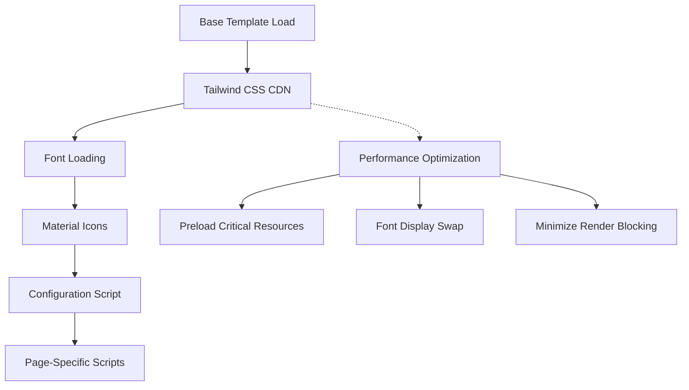

# Design Document: Tailwind CSS Fix

## Overview

This design addresses critical Tailwind CSS loading issues in the EYTGaming platform by implementing proper script loading order, eliminating race conditions, and ensuring consistent styling across all pages. The solution focuses on restructuring the base template to load Tailwind CSS before any configuration scripts execute, while maintaining performance and accessibility standards.

## Architecture

### Current Problem
The existing implementation suffers from a race condition where Tailwind configuration scripts execute before the Tailwind CSS library has fully loaded, causing "tailwind is not defined" JavaScript errors and broken styling.

### Solution Architecture


### Loading Strategy
1. **Sequential Loading**: Ensure Tailwind CSS loads before configuration
2. **Deferred Execution**: Use `defer` attribute for proper script ordering
3. **Performance Optimization**: Implement preloading and font-display strategies
4. **Fallback Handling**: Provide graceful degradation for unsupported browsers

## Components and Interfaces

### Base Template Structure
```html
<!-- Critical CSS and Fonts (Preloaded) -->
<link rel="preload" href="..." as="style">
<link rel="preload" href="..." as="font" crossorigin>

<!-- Tailwind CSS CDN (Primary) -->
<script src="https://cdn.tailwindcss.com" defer></script>

<!-- Configuration Script (Deferred) -->
<script defer>
  document.addEventListener('DOMContentLoaded', function() {
    if (typeof tailwind !== 'undefined') {
      tailwind.config = { /* configuration */ };
    }
  });
</script>
```

### Configuration Module
The Tailwind configuration will be encapsulated in a module that:
- Checks for Tailwind availability before execution
- Applies EYTGaming brand colors and fonts
- Handles dark mode configuration
- Provides fallback behavior

### Error Handling Module
A dedicated error handling system that:
- Detects when Tailwind fails to load
- Provides fallback styling
- Logs configuration errors
- Maintains basic functionality

## Data Models

### Configuration Object
```javascript
const tailwindConfig = {
  theme: {
    extend: {
      colors: {
        primary: {
          DEFAULT: '#b91c1c',  // EYTGaming Red
          50: '#fef2f2',
          100: '#fee2e2',
          // ... color scale
        }
      },
      fontFamily: {
        display: ['Spline Sans', 'sans-serif']
      }
    }
  },
  darkMode: 'class'
};
```

### Loading State Management
```javascript
const LoadingState = {
  PENDING: 'pending',
  LOADED: 'loaded',
  ERROR: 'error',
  CONFIGURED: 'configured'
};
```

## Correctness Properties

*A property is a characteristic or behavior that should hold true across all valid executions of a system-essentially, a formal statement about what the system should do. Properties serve as the bridge between human-readable specifications and machine-verifiable correctness guarantees.*

### Property Reflection

After analyzing all acceptance criteria, I identified several properties that can be consolidated:
- Properties 1.1, 1.2, 1.3, and 1.4 all relate to proper loading order and error prevention and can be combined into a comprehensive loading property
- Properties 2.1 and 2.3 relate to brand configuration values and can be combined
- Properties 3.1, 3.2, and 3.4 relate to performance optimization and can be combined
- Properties 4.2, 4.3, and 4.4 relate to graceful fallback behavior and can be combined
- Properties 5.1, 5.2, 5.3, and 5.4 all relate to accessibility compliance and can be combined

### Correctness Properties

Property 1: Tailwind Loading Order and Error Prevention
*For any* page load, the Tailwind CSS library should be fully loaded and the tailwind object should be defined before any configuration scripts execute, no "tailwind is not defined" errors should occur, and configuration should be applied immediately without race conditions
**Validates: Requirements 1.1, 1.2, 1.3, 1.4**

Property 2: Brand Configuration Consistency
*For any* Tailwind configuration, the primary color should be set to EYTGaming brand red (#b91c1c) and the display font family should be set to Spline Sans
**Validates: Requirements 2.1, 2.3**

Property 3: Dark Mode Color Application
*For any* page with dark mode enabled, the system should apply the configured dark theme colors correctly
**Validates: Requirements 2.2**

Property 4: Performance Optimization Implementation
*For any* page load, render-blocking resources should be minimized, fonts should use font-display: swap, critical CSS should be inlined when needed, and layout shift should be prevented during CSS loading
**Validates: Requirements 3.1, 3.2, 3.3, 3.4**

Property 5: Cross-Browser Consistency
*For any* browser environment, styling should render consistently across different browsers
**Validates: Requirements 4.1**

Property 6: Graceful Fallback Behavior
*For any* unsupported browser environment, older browser, or when JavaScript is disabled, the system should provide fallback mechanisms that maintain basic styling, functionality, and readability
**Validates: Requirements 4.2, 4.3, 4.4**

Property 7: Accessibility Compliance
*For any* interactive element, color combination, or focus indicator, the system should provide proper contrast ratios, maintain WCAG AA standards in dark mode, ensure interactive elements meet accessibility guidelines, and verify custom colors pass accessibility standards
**Validates: Requirements 5.1, 5.2, 5.3, 5.4**

## Error Handling

### JavaScript Error Prevention
- **Tailwind Availability Check**: Always verify `typeof tailwind !== 'undefined'` before configuration
- **Configuration Validation**: Validate configuration object structure before applying
- **Fallback Configuration**: Provide default configuration if custom config fails

### CSS Loading Failures
- **CDN Fallback**: Implement local Tailwind CSS fallback if CDN fails
- **Critical CSS Inline**: Ensure essential styles are available even if external CSS fails
- **Progressive Enhancement**: Design works without Tailwind, enhanced with it

### Browser Compatibility Issues
- **Feature Detection**: Use CSS `@supports` for advanced features
- **Polyfill Strategy**: Load polyfills only when needed for older browsers
- **Graceful Degradation**: Ensure core functionality works in all browsers
- **Cross-Browser Testing**: Validate consistency across Chrome, Firefox, Safari, and Edge
- **Legacy Browser Support**: Provide appropriate fallbacks for Internet Explorer and older mobile browsers

## Testing Strategy

### Dual Testing Approach
This implementation requires both unit tests and property-based tests to ensure comprehensive coverage:

**Unit Tests** focus on:
- Specific configuration scenarios (brand colors, fonts, dark mode)
- Error handling edge cases (CDN failures, invalid configurations)
- Browser compatibility specific cases (older browsers, disabled JavaScript)
- Integration points between components
- Material Icons styling consistency

**Property-Based Tests** focus on:
- Universal loading order properties across all page types
- Configuration consistency across all Tailwind instances
- Performance characteristics across different loading conditions
- Cross-browser rendering consistency across different environments
- Accessibility compliance across all color combinations and interactive elements
- Graceful fallback behavior across various constraint scenarios

### Property-Based Testing Configuration
- **Testing Library**: Use fast-check for JavaScript property-based testing
- **Test Iterations**: Minimum 100 iterations per property test
- **Test Environment**: Browser automation with Playwright for DOM testing
- **Tag Format**: Each test tagged as **Feature: tailwind-css-fix, Property {number}: {property_text}**

### Testing Implementation Requirements
- Each correctness property must be implemented as a single property-based test
- Unit tests complement property tests by covering specific examples and edge cases
- Tests should run in both development and CI environments
- Performance tests should measure actual loading times, resource counts, and layout stability metrics
- Cross-browser tests should validate consistency across Chrome, Firefox, Safari, and Edge
- Accessibility tests should use automated tools like axe-core for WCAG compliance verification
- Fallback tests should simulate older browsers and disabled JavaScript scenarios

The testing strategy ensures that Tailwind CSS loading works reliably across all scenarios while maintaining performance, cross-browser compatibility, and accessibility standards.